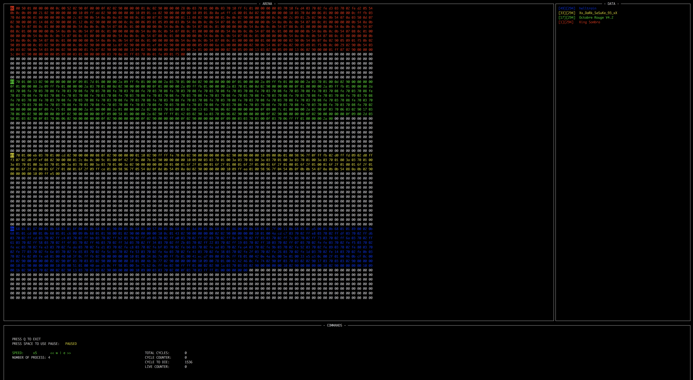

# Corewar

• Corewar is a very peculiar game. It’s about bringing “players” together around a
“virtual machine”, which will load some “champions” who will fight against one another with the support of “processes”, with the objective being for these champions
to stay “alive”.

• The processes are executed sequentially within the same virtual machine and memory space. They can therefore, among other things, write and rewrite on top of
each others so to corrupt one another, force the others to execute instructions that
can damage them.

• The game ends when all the processes are dead. The winner is the last player
reported to be “alive”

# Usage :

First you will need to compile ur assembler files to .cor files with our tool "./assembler/asm"
> assembler/asm champions/name_of_a_champion.s

> assembler/asm champions/name_of_a_champion2.s

Then the war can begin:
> vm/corewar -i champions/"name_of_a_champion".cor champions/"name_of_a_champion2".cor

# Overview

**an Arena magicly opens and you can start the fight by pressing space**

